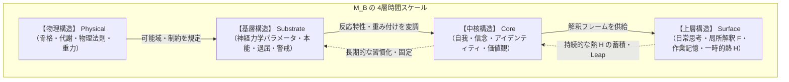

# 01_4層時間スケール構造

*RDL Human / 基層構造・神経力学 T1 / v1.0*  
*依存: RDL_Core (T0基底仮設 / T0最低動作仕様)*

---

## 1. 目的と責務

本文書は、人間（および基層構造を持つ任意の生体・自律エージェント）の整合構造 $M_B$ を、**変化の時間スケール（安定度）の差異**によって4つの階層に分解・モデル化することを目的とする。

この4層構造は、生身の人間に限らず、AIエージェント、NPC、組織、社会制度など、有限境界 $B$ のもとで自己を維持しながら環境と代謝するあらゆるシステムに適用できる汎用的な操作フレームワークである。

---

## 2. 4層の基本定義

整合構造 $M_B$ は、時間スケールの遅い（超安定）層から速い（可変）層へ向かって、次の4層に階層化される。

```text
物理構造  ＞  基層構造  ＞  中核構造  ＞  上層構造
←── 安定・低速（長期的制約） ─────────── 不安定・高速（即時適応） ──→
```



| 階層 | 名称 | 時間スケール | 人間における具体例 | RDLにおける役割 |
| :--- | :--- | :--- | :--- | :--- |
| **第1層** | **物理構造** (Physical) | 超低速〜不変（一生以上） | 骨格、筋骨格系、内臓代謝、重力下の力学的制約、神経系の物理配線 | 上位すべての層が機能するための**物質的・エネルギー的可能域**を決定する。 |
| **第2層** | **基層構造** (Substrate) | 低速（進化・個体の初期設定） | 神経伝達物質の受容体密度、探索性（DA）、不安感受性（5-HT）、警戒反応（NA） | 個体の**反応特性・熱発生係数・自己境界拡張の基本重み**を決定する。 |
| **第3層** | **中核構造** (Core) | 中速（年〜数十年） | 自我同一性、信念体系、人生観、深層の習慣、言語体系 | 自己の連続性を支える**中核的な整合慣性 $M_B$**。解釈の基準となる。 |
| **第4層** | **上層構造** (Surface) | 高速（秒〜日） | 瞬時の思考、感情の波、作業記憶、会話の文脈、局所的な予測 | 環境からの刺激（$\text{EFP}$）を直接処理し、**即時的な解釈 $F$ と誤差 $E$・熱 $H$ を生成**する。 |

---

## 3. 層間の相互作用則

### 3.1 下層から上層への「制約と変調」
- **下層は上層の可能域を決定する**: 物理構造（第1層）や基層構造（第2層）に反する上層構造（第4層）は維持できない（例：睡眠不足で物理層が破綻すると、中核層の信念に関わらず上層の思考は停止する）。
- **基層構造は中核構造の形成傾向をバイアスする**: 基層の神経力学パラメータ（探索欲が高い、不安になりやすい等）が、その個体がどのような中核信念（中核層）を好んで採用するかを方向づける。

### 3.2 上層から下層への「蓄積と再編（Leap）」
- **上層の熱 $H$ の持続的蓄積**: 上層（第4層）で解消されない誤差 $E$ が長期間蓄積（$H$ が臨界突破）すると、中核構造（第3層）への再編圧（**中核的跳躍 / アイデンティティの変容**）として波及する。
- **中核構造の沈殿による基層化**: 長年の訓練や環境適応によって強固に定着した中核構造は、やがて自動化され、基層に近い反射的・直感的な反応特性へと沈殿していく。

---

## 4. 破断条件と修復優先順位

各層が環境からの刺激や過負荷によって破断した場合の挙動は以下の通りである。

```text
物理構造の破断 ──→ 生命維持の危機（全層の強制停止）
基層構造の破断 ──→ 神経・情動機能の破綻（パニック、過覚醒、無気力）
中核構造の破断 ──→ アイデンティティクライシス（信念崩壊、価値観の喪失）
上層構造の破断 ──→ 一時的な混乱・日常的フラストレーション（局所的放熱で修復可能）
```

:::message
**【設計原則】**  
下層が破断したときは、上層の処理（議論・思考・説得）で解決しようとしてはならない。  
物理構造（睡眠・栄養・安全） $\to$ 基層構造（情動の沈静化） $\to$ 中核構造（再解釈と価値観の再構築）の順に、**下層から順に整合慣性を回復させる**必要がある。
:::