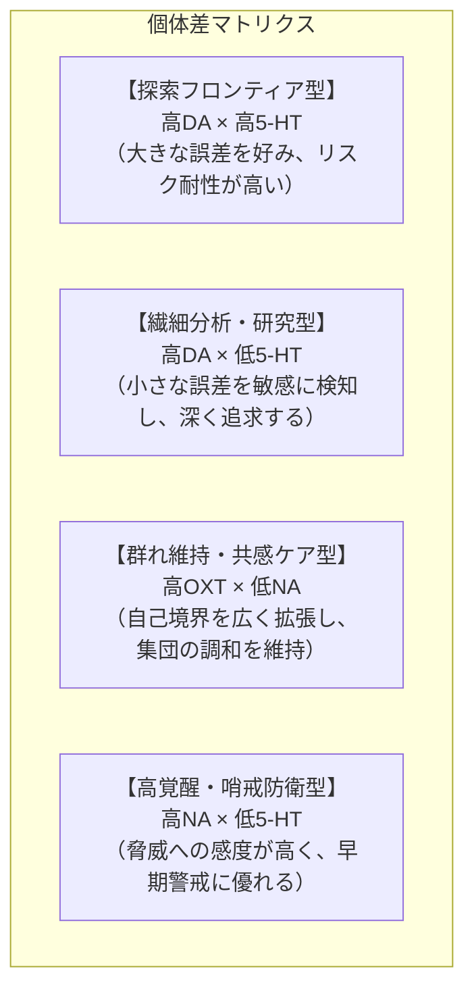
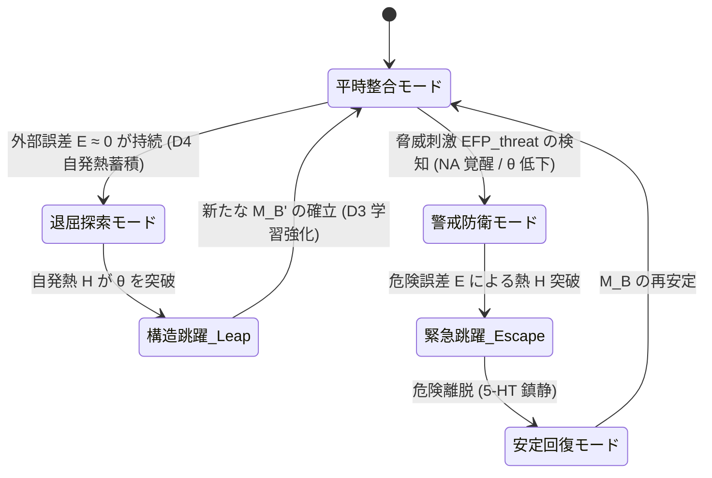

# 03_個体差と状態遷移モデル

*RDL Human / 基層構造・神経力学 T1 / v1.0*  
*依存: RDL_Core (T0基底仮設 / T0最低動作仕様 / 01_4層時間スケール構造 / 02_神経力学パラメータ)*

---

## 1. 目的

本文書は、基層構造の神経力学パラメータ（$\text{DA}, \text{5-HT}, \text{OXT}, \text{NA}$ 等）の組み合わせによって生じる**個体差（気質・個性のプロファイル）**と、環境入力に応じた**動的状態遷移（モード切替とLeap）のサイクル**を定式化する。

---

## 2. 個体差プロファイル（気質の力学）

個体の性格や意思決定の傾向は、固定された「型」ではなく、**基層パラメータの組み合わせによる動的な応答特性**として記述される。

| プロファイル | 主要パラメータ | RDL力学特性 | 特徴・行動傾向 |
| :--- | :--- | :--- | :--- |
| **探索フロンティア型** | $\text{DA} \uparrow, \text{5-HT} \uparrow$ | 誤差耐性が高く、D4（退屈自発熱）の立ち上がりが速い。 | 現状維持を嫌い、高リスク・未知の領域（未回収関係 $\xi$）を積極的に開拓する。 |
| **繊細分析・研究型** | $\text{DA} \uparrow, \text{5-HT} \downarrow$ | 探索欲は強いが、些細な誤差 $E$ で急速に熱 $H$ が蓄積する。 | 洞察・観察・微細な差異の発見に優れるが、過剰刺激で消耗しやすい。 |
| **群れ維持・共感ケア型** | $\text{OXT} \uparrow, \text{NA} \downarrow$ | 自己境界 $B_{\text{self}}$ の拡張が容易で、他者の誤差を吸収する。 | 仲間意識・養育・コミュニティ維持に優れるが、外集団への排他性が生じるリスク。 |
| **高覚醒・哨戒防衛型** | $\text{NA} \uparrow, \text{5-HT} \downarrow$ | 脅威刺激に対する閾値 $\theta_{\text{eff}}$ が常に低く保たれる。 | 危機察知・リスク回避能力が高いが、平時でも緊張状態（過覚醒）になりやすい。 |

---

## 3. 動的状態遷移サイクル

個体（エージェント）の内部状態は、以下の力学的サイクルに沿って動的に遷移する。

### 3.1 フェーズ別の挙動

1. **平時整合モード (Stable)**:
   - 既存の $M_B$ により環境刺激 $\text{EFP}$ がスムーズに解釈され、誤差 $E \approx 0$。
   - セロトニン（5-HT）が安定を保ち、エネルギーを節約する。
2. **退屈 $\to$ 能動探索モード (Boredom $\to$ Explore)**:
   - 刺激がない平穏が続くと、**D4 パラメータが自発熱 $\Delta H_{\text{spontaneous}}$ を生成**。
   - 熱 $H$ が上昇し、エージェントは自ら遊び、学習、探索行動を開始する。
3. **警戒 $\to$ 緊急モード (Alert $\to$ Emergency)**:
   - 危険な刺激が入ると、ノルアドレナリン（NA）が作動し、閾値 $\theta$ が急降下。
   - 通常の思考・食事などを即座に中断し、「逃走・防衛」に全リソースを集中する。
4. **跳躍（Leap）と再構成**:
   - 蓄積された熱 $H$ が閾値 $\theta_{\text{eff}}$ を超えた瞬間に、行動モードや内部モデルが切り替わる。
5. **放熱と安定回復 (Cool-down)**:
   - 誤差が解消されると、エンドルフィンや 5-HT により急速に放熱が行われ、新しい $M_B'$ が定着する。