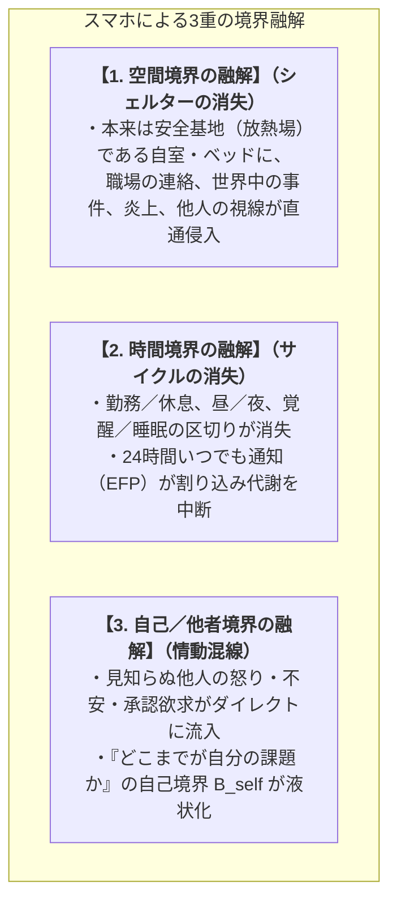

# 02_道具結合と身体拡張モデル

*RDL Human (T3応用層) / 関係ネットワーク行動力学 / DRAFT v1.3*  
*ステータス: Human固有仮説 / T2概念耐久検査済*  
*依存: RDL_Core / 01_関係ネットワーク行動力学_総論 / 01_基層構造_神経力学*

---

## ■ 0. 目的とスコープ

人間は、衣服、刃物、車、スマートフォン、重機、武器、AIに至るまで、常に外部の道具と結合（Coupling）して存在している。

本文書は、**「物理的道具との結合が、行為可能域（Affordance）やコスト・危険の地形をいかに変化させ、認知空間（$\text{Space}_B$）を変形させることで、同じ個体から異なる流向（Flow）を露出させるか」**を力学モデルとして定式化する。

:::message
**【スコープの明確化：物理的道具と概念的道具の分離】**  
- **物理的道具（本文書の対象）**: 車、重機、スマホ端末、義肢、AIツール等の「身体性・行為可能域を直接変形する道具」。
- **概念的道具・制度（社会層の対象）**: 貨幣、法律、契約、宗教等の「複数個体の認知空間を束ね、巨大な社会的重力場を形成する共有規格」は、`06_対話_倫理_社会生態系` にて扱う。
:::

---

## ■ 1. 道具結合（Coupling）と認知空間変形の力学

道具との結合は、「個体の人格を書き換える」のではなく、**「個体が直面する行為可能域とコスト地形（$\text{Space}_B$）を変形させ、その結果として異なる流向（Flow）を露出可能にする」**現象である。

```text
道具（Tool）との結合
       ↓ 行為可能域・出力・速度・装甲の付与（または境界の透過）
個体 M_B^person による解釈：interp(M_B^person, Tool)
       ↓
認知空間 Space_B の局所変形（距離感・越境コスト・障害の知覚・境界の融解）
       ↓
流向 Flow の変容（同じ個体から別の行動・性格表現型が露出）
```

結合状態の操作的記述：

$$
\text{Space}_B^{\text{coupled}} = \text{interp}\left(M_B^{\text{person}}, W_{\text{organism}} \oplus_{\kappa} Tool\right)
$$

ここで $\kappa \in [0, 1]$ は**結合強度（Coupling Ratio / 操作の身体化度）**である。

---

## ■ 2. 道具結合の2大類型：【装甲拡張型】 vs 【境界融解型】

物理的道具は、自己境界 $B_{\text{self}}$ に与える幾何学的変形によって、大きく2つのタイプに大別される。

```text
┌─────────────────────────────────────────────────────────────┐
│ 1. 装甲・拡張型 (Armored / Extended Type) ──【外殻の硬化】  │
│    ・自動車、重機、武器、防護服                             │
│    ・質量・速度・出力・装甲を外側へ拡張                     │
│    ・パーソナルスペースの巨大化と攻撃・慎重流向の露出       │
├─────────────────────────────────────────────────────────────┤
│ 2. 境界融解型 (Boundary Dissolution Type) ──【境界の液状化】│
│    ・スマートフォン、常時接続端末、スマートウォッチ         │
│    ・空間・時間・自他の境界を透過・消失させる               │
│    ・放熱場の消失、慢性的過覚醒（Alert微熱）の滞留          │
└─────────────────────────────────────────────────────────────┘
```

---

## ■ 3. 代表的結合事例の力学分析

### 3.1 自動車との結合（装甲拡張型：「車に乗ると性格が変わる」現象）

```text
【生身状態】 質量 60kg / 速度 4km/h / 出力 0.1ps / 生身装甲
       ↓ 車両結合（κ → 1）
【車結合状態】 質量 1,500kg / 速度 60〜150km/h / 出力 150〜300ps / 鉄板装甲
```

#### 空間変形と流向露出のメカニズム：
1. **自己境界 $B_{\text{self}}$ の拡張と侵入過敏**:
   - 車体輪郭が $B_{\text{self}}$ の外枠として解釈されるため、他車による車間詰めや割り込みが「身体パーソナルスペースへの直接侵入」と等価に処理され、熱 $H$ が発生しやすい。
2. **圧倒的出力と摩擦（ブレーキ）のギャップ**:
   - 右足一本で数百馬力を出せる「高速移動可能域」にいるため、前走車の減速や赤信号が**「エネルギーの急激な詰まり（未放熱）」**として知覚され、焦燥が生じやすい。
3. **個体の $M_B^{\text{person}}$ による流向の分岐**:
   - **分岐 A（強気・攻撃流向の露出）**: 装甲による防衛感と出力を「自己の拡張」として解釈する個体 $\to$ クラクション、煽り、急加速。
   - **分岐 B（慎重・警戒流向の露出）**: 1.5トンの巨大な運動エネルギーが持つ「加害リスク・大事故の破壊力」を重く解釈（$w_{\text{threat}}$ 高）する個体 $\to$ より入念な確認、安全運転。

---

### 3.2 スマートフォンとの結合（境界融解型：「境界が溶け出す」現象）

スマートフォンは、単なる情報検索ツールではなく、**「生体が自己維持のために引いていた多重境界を融解させる特殊な浸透型デバイス」**である。



#### 力学的帰結（なぜ人間はスマホで疲弊するのか？）：
1. **放熱場の完全消失**:
   - 人間が精神の整合性を保つには、「外部刺激（$\text{EFP}$）を遮断し、熱 $H$ をゼロにリセットする閉じた安全な窪地」が不可欠である。スマホはこの窪地を破壊し、24時間未回収関係 $\xi$ を流入させ続ける。
2. **慢性的過覚醒（Alert 微熱滞留）**:
   - 常に `Alert`（NA）が微小励起し続け、睡眠の質の低下、アテンションの細片化（集中力破綻）、慢性的疲労を引き起こす。

---

### 3.3 重機・高性能ツールとの結合

- **局所剛性の圧倒的非対称性**:
  - わずかな操作で環境を改変・破壊できるため、物理的抵抗のコストが極小化。
  - 繊細な手作業・対人調整の流向から、マクロな構造変更の流向へとモードが切り替わる。

---

## ■ 4. 道具設計における力学的示唆

:::message
**【安全で健全な道具設計の2大原則】**  
1. **装甲拡張型（車・重機・AI）**:
   - 出力や速度だけを一方的に拡大せず、**相手の抵抗や痛みのフィードバック（$E_{\text{sim}}$）を適切にドライバーへ返す設計**（遮断された万能感による暴走を防ぐ）。
2. **境界融解型（スマホ・常時接続アプリ）**:
   - ユーザーの注意を無限に奪い続ける浸透設計を戒め、**「ユーザーが自律的に境界を閉じ、安全に放熱（オフライン化）できる時間・空間のシェルター」**を回復させる設計。
:::

---

## ■ 5. T2 概念耐久検査ログ

```text
・検査対象: 道具結合と身体拡張モデル
・初期前提: 「道具は人間の身体・行為可能域を外側へ拡張する（出力増強モデル）」
・投入した極端条件（破断アタック）:
  1. 道具による人間の逆支配（スマホ・SNS・アルゴリズムが人間の注意を拘束する現象）
  2. 貨幣という道具の目的化（人間が資本増殖の部品になる現象）
・破断した点:
  - 道具を一括りに「身体の出力拡張」として扱っていた点。
  - 貨幣などの「概念的道具」と、車などの「物理的道具」が混同されていた点。
・修正内容:
  1. 貨幣・法等の概念的道具を社会層（T3）へ分離。
  2. 物理的道具を「装甲拡張型（外殻強化）」と「境界融解型（時間・空間・自他の液状化）」の2類型に二分化。
・残存構造: 結合強度 κ による Space_B の変形と流向露出メカニズム。
・未回収関係 ξ: AIエージェントやウェアラブル等の物理/概念ハイブリッド結合体の詳細力学。
```
