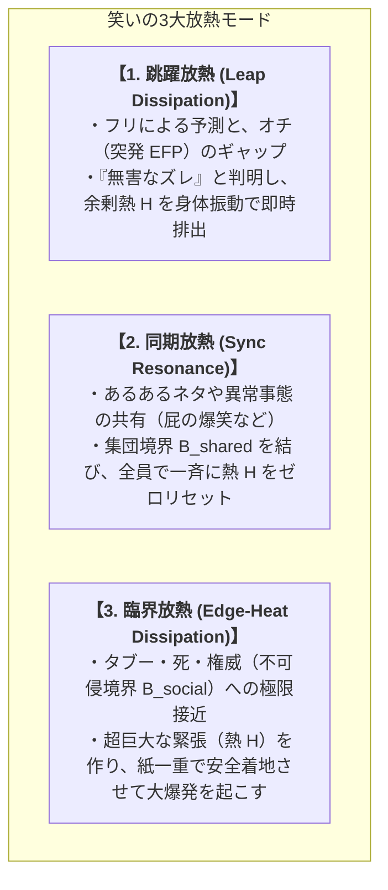

# 01_快と笑いの放熱力学

*RDL Human (T3応用層) / 認知・情動・放熱 / DRAFT v1.2*  
*ステータス: Human固有仮説 / T2耐久検査済（簡易）*  
*依存: RDL_Core / 01_基層構造_神経力学 / 02_関係ネットワーク行動力学*

---

## ■ 0. 目的と一文定義

> **情動体験における「快」と「笑い」は、個体の整合構造 $M_B$ において、未回収関係 $\xi$ や予測誤差 $E$、蓄積された内部熱 $H$ が解消・解放される際に生じる「力学的放熱現象（Heat Dissipation Dynamics）」として定義される。**

---

## ■ 1. 「快（Pleasure）」の力学：通水と代謝の報酬

```text
予測誤差 E の検知（不快・熱 H の発生）
       │
       ▼ 能動的行動・学習・推論
誤差 E の収束・整合（E → 0）
       │
       ▼ スムーズなエネルギー通水
【快の発生】（DAによる学習強化 ＋ エンドルフィンによる鎮痛・報酬）
```

- **定式化**:
  $$\text{Pleasure} = \alpha_{\text{DA}} \cdot \left(-\frac{dE}{dt}\right) + \beta_{\text{flow}} \cdot \text{Throughput}(Flow)$$
- **力学的本質**:
  - 快とは、静的な「無刺激」ではなく、**「誤差が解消に向かう速度（$-\frac{dE}{dt}$）」**および**「関係の流れが詰まらずに循環している状態（通水感）」**である。

---

## ■ 2. 「笑い（Laughter）」の力学：急速身体放熱モデル

「笑い」は、人間特有の高度な安全弁（放熱バイパス機構）であり、**「巧みな熱と流れの力学操作（Thermal & Flow Manipulation）」**である。



---

## ■ 3. 臨界放熱（境界ギリギリの笑い）の力学

ブラックジョーク、毒舌、タブー破り、政治風刺が最も強烈な笑い（カタルシス）を生むメカニズム：

```mermaid
graph TD
    subgraph 境界ギリギリ（臨界）の攻防
        T1["<b>【不可侵境界 B_social への急接近】</b><br>・『おいそれ触れて大丈夫か！？』という炎上・処罰の恐怖<br>・緊張と恐怖で内部熱 H が臨界（θ）寸前まで跳ね上がる！"]
        
        T1 --> D{境界操作の成否}
        
        D -->|絶妙な文脈・自虐で安全着地！| S1["<b>【大爆笑・カタルシス（超巨大放熱）】</b><br>・『無害化』に成功し、臨界寸前の超巨大熱 H が一気に大気中へ解放<br>・爆発的な多幸感（DA / エンドルフィン）が放出される"]
        
        D -->|踏み外して境界侵害！| S2["<b>【破断・炎上（激怒・攻撃）】</b><br>・不快・侮辱・倫理境界の完全破断<br>・熱 H が行き場を失い、攻撃（高NA）へ転化"]
    end
```

### 3.1 落差エネルギーと共有タブーの解除
1. **熱 $H$ の落差の最大化**:
   - 日常の小さなズレ（低熱 $H$） $\to$ クスッ（小放熱）。
   - タブー・不可侵境界への接近（超高熱 $H$） $\to$ 大爆笑（超巨大放熱）。
2. **共有された抑圧の解除**:
   - 集団全体が言えずに抱えていた未回収関係 $\xi$（重い社会的境界）を、芸人・語り手がギリギリの技術で言葉にして無害化した瞬間、**全員を縛っていた境界が一瞬で外れ、集団全体が一斉に肩の荷を下ろすような解放感**が生まれる。

---

## ■ 4. 笑いの身体性と集団力学

1. **なぜ横隔膜の痙攣・発声（ハッハッハ）なのか？**:
   - 認知空間（上層）だけで処理しようとすると、跳躍で生じた余剰熱 $H$ で脳が過負荷になる。
   - そこで、**呼気とともに音波・身体運動エネルギーとして熱を大気中へ直接捨てる（身体的バイパス）**のが笑いの物理的実体である。
2. **笑いの暗黒面（嘲笑・いじめ・生贄）**:
   - 集団が結束する安易な方法は、**特定の個人を「境界の外側（笑いの対象）」に指定し、集団内の熱 $H$ をその対象へ向けて放熱すること**である。笑いは最高の癒やしであると同時に、最も残酷な排除の凶器にもなり得る。
