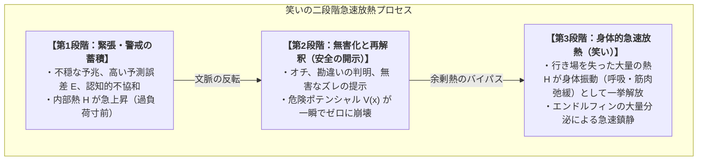

# 01_快と笑いの放熱力学

*RDL Human / 認知・情動・放熱力学 T2 / DRAFT v1.0 (仮配置)*  
*依存: RDL_Core / 02_基層構造_神経力学_T1 / 03_関係ネットワーク行動力学_T2*

---

## ■ 0. 目的と一文定義

> **情動体験における「快」と「笑い」は、個体の整合構造 $M_B$ において、未回収関係 $\xi$ や予測誤差 $E$、蓄積された内部熱 $H$ が解消・解放される際に生じる「力学的放熱現象（Heat Dissipation Dynamics）」として定義される。**

---

## ■ 1. 「快（Pleasure）」の力学

```text
予測誤差 E の検知（不快・熱 H の発生）
       │
       ▼ 能動的行動・学習・推論
誤差 E の収束・整合（E → 0）
       │
       ▼ スムーズなエネルギー通水
【快の発生】（DAによる学習強化 ＋ エンドルフィンによる鎮痛・報酬）
```

- **定式化**:
  $$\text{Pleasure} = \alpha_{\text{DA}} \cdot \left(-\frac{dE}{dt}\right) + \beta_{\text{flow}} \cdot \text{Throughput}(Flow)$$
- **力学的本質**:
  - 快とは、静的な「無刺激」ではなく、**「誤差が解消に向かう速度（$-\frac{dE}{dt}$）」**および**「関係の流れが詰まらずに循環している状態（通水感）」**である。

---

## ■ 2. 「笑い（Laughter）」の力学：急速放熱モデル

「笑い」は、人間特有の高度な安全弁（放熱バイパス機構）である。



### 2.1 なぜ人間は笑うのか？
- 蓄積された熱 $H$ をまともに中核構造 $M_B$ の書き換え（アイデンティティの再編）に使おうとすると、膨大な認知コストがかかる。
- 「これは危険ではなく、ただのズレ（無害）だった」と判明した瞬間、**不要になった膨大な熱 $H$ を身体の痙攣・発声として一気に大気中へ捨てる（放熱する）のが「笑い」の正体**である。
