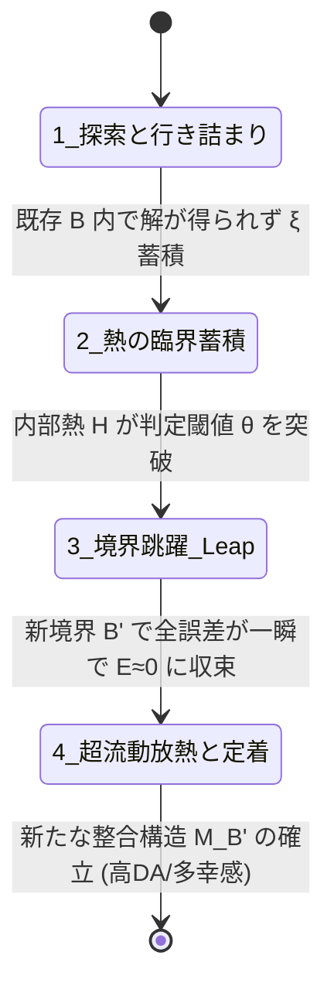

# 02_アハ体験と認知跳躍モデル

*RDL Human / 認知・情動・放熱力学 T2 / DRAFT v1.0 (仮配置)*  
*依存: RDL_Core / 01_4層時間スケール構造 / 慣性と相転移の生態力学*

---

## ■ 0. 目的と一文定義

> **アハ体験（Aha! / 洞察）および認知的跳躍（Leap）とは、既存の境界設定 $B$ では解消不能となった未回収関係 $\xi$ と熱 $H$ の累積が閾値 $\theta$ を突破した際、境界配置そのものが瞬時に再編され、新たな整合構造 $M_B'$ へと相転移する現象である。**

---

## ■ 1. アハ体験の4段階力学フェーズ

1. **第1段階：既存枠組みでの線形探索と行き詰まり**:
   - 既存の $M_B$ と境界 $B$ の中で解を探すが、未回収関係 $\xi$ が回収できない。
2. **第2段階：熱 $H$ の臨界蓄積（フラストレーション）**:
   - 誤差 $E$ が解消されず、内部熱 $H$ が上昇。認知空間のポテンシャルが過負荷に達する。
3. **第3段階：境界跳躍（Leap / 相転移）**:
   - $H > \theta_{\text{eff}}$ となり、**境界の引き方そのもの（$B \to B'$）が再編**される。
4. **第4段階：超流動的放熱と定着（「わかった！」の瞬間）**:
   - 新しい境界 $B'$ のもとで、今までバラバラだった全要素が一瞬で矛盾なく整合（$E \to 0$）。
   - 蓄積されていた熱が一気に解消され、強烈な快感（ドーパミン急上昇）とともに新しい $M_B'$ が強固に定着する。
