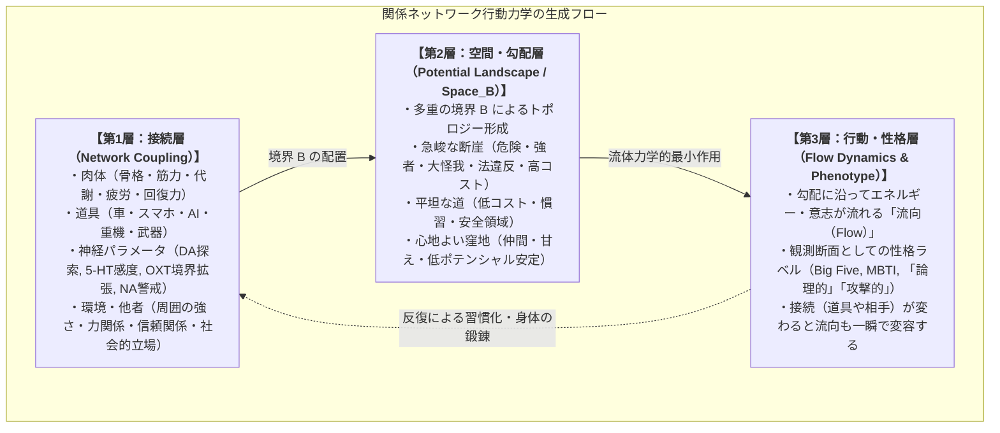

# 01_関係ネットワーク行動力学_総論

*RDL Human / 関係ネットワーク行動力学 T2 / v1.0*  
*依存: RDL_Core (T0基底仮設 / T0最低動作仕様) / RDL_Human (02_基層構造_神経力学_T1)*

---

## ■ 0. 核心テーゼ（一文定義）

> **人間の行動および性格とは、個体の内部に固定された静的属性ではなく、肉体・道具・神経・他者・社会といった「重層的な関係ネットワーク（$W_{ij}$）」の結節点において、多重の境界（$B$）が引く空間の勾配（Gradient）に沿って自然に立ち現れる「流向（Flow）」である。**

```text
伝統的心理学：
  個人内部の固定部品（遺伝・性格・意志） ──→ 行動

関係ネットワーク行動力学：
  関係ネットワーク W_ij（肉体・道具・他者・場）
         ↓ 境界 B の相互作用
  認知空間の勾配場 Space_B
         ↓ 最も無理のない経路を流れる
  流向（Flow ＝ 行動・性格表現型）
```

---

## ■ 1. 3層の生成アーキテクチャ

本体系では、人間の行動や性格表現型の生成プロセスを以下の3つの力学層としてモデル化する。



---

## ■ 2. 行動・性格を規定する4大原理

### 原理 1：ハードウェア適応原理（肉体スペックと運用の整合性）
性格とは、その個体が持つ肉体（第1層：物理構造）を**安全かつ壊さずに生き延びさせるために最適化された運用OS**である。
- **強靭な肉体（高耐久・高回復力）**:
  - 衝突や怪我のリスクが低いため、脅威閾値 $\theta_{\text{threat}}$ が高く保たれる。
  - 越境コストが極小化され、直接探索型の流向（**「大胆」「行動派」「物怖じしない」「外向的」**）が最適解となる。
- **繊細・低耐久な肉体（疲れやすく壊れやすい）**:
  - 物理衝突を避けるため、遠距離の危機を事前に高解像度で予測する（$R(d_{\text{threat}})$ の高精度化）。
  - 事前計算や同盟関係による防衛（**「慎重」「論理的・分析的」「共感的・協調的」**）が最適解となる。

### 原理 2：道具結合（サイボーグ化）による即時変容原理
人間は道具（特にエネルギー・速度・防御力を増幅する装置）と結合した瞬間、**物理層スペックが一瞬で書き換わり、それに伴って新しい性格（流向）が自動生成される**。
- **例（車の運転）**:
  - 生身（60kg・時速4km）が、車とのリンクにより「1.5トン・鉄の装甲・時速100km・数百馬力」の巨体へと物理層が拡張。
  - 自己境界 $B_{\text{self}}$ が車体まで広がり、前走車や信号が「摩擦・障害」として認知されることで、普段は穏やかな個体に**「強気・短気・攻撃的」**な流向が発現する。

### 原理 3：場の相対剛性原理（周囲の強さと礼節・知性の創発）
個体の振る舞いは、自分自身の絶対的強さではなく、**「相手や周囲との力学的な剛性バランス」**によって決定される。
- **周囲も強靭な環境（猛者・プロ集団）**:
  - 力押しが致命的な共倒れ（破断）を招くため、明確な境界 $B$（礼儀・ルール）と高度な相手状態の推定（$E_{\text{sim}}$）が発達し、**「礼儀正しい」「理知的」「戦略的」「協調的」**な流向が生じる。
- **周囲が弱い環境（無抵抗な場）**:
  - 境界を意識せず力押しが通ってしまうため、**「横柄」「大雑把」「支配的」**な流向へと劣化しやすい。

### 原理 4：多重境界勾配原理（流向としての性格）
空間に引かれた無数の境界（身体限界、他者、法律、立場、言語）は、認知空間に高低差（ポテンシャル勾配）を作り出す。
- 人間の意志やエネルギーは、この**勾配の最も低い抵抗の経路（等高線や谷）を水のように流れる**。
- したがって、性格を変えるとは「心を無理に変える」ことではなく、**「環境・道具・人間関係という境界の配置（$\Delta W_{ij}$）を変えて、空間の勾配を再設計すること」**である。

---

## ■ 3. 伝統的性格モデル（Big Five / MBTI）の再解釈

本体系において、既存の性格特性論は「人間を作る固定部品」ではなく、**「特定の関係ネットワークと観測境界 $B$ における安定流向の切り出し（断面）」**として統合される。

| 既存ラベル | 伝統的解釈 | 関係ネットワーク行動力学での解釈 |
| :--- | :--- | :--- |
| **外向性 (E)** | 心が外に向く性質 | 自己境界 $B_{\text{self}}$ の包摂範囲の広さ、または他者方向への越境コストの低さによる接近流向。 |
| **誠実性 (C)** | 我慢強さ・自制心 | 遠距離目標 $R(d_{\text{goal}})$ の現在価値が目前の誘惑を上回り、引いた境界 $P_{\text{hold}}$ を維持する流向。 |
| **神経症傾向 (N)** | 不安になりやすさ | 危機予測 $R(d_{\text{threat}})$ の高感度と、誤差 $E$ が急速に熱 $H$ へ変換される流向。 |
| **開放性 (O)** | 好奇心・新奇性 | 未知・未確定な領域（$\xi$）に対し、既存の境界を引き直す（$P_{\text{redraw}}$）探索流向。 |
| **論理性 / T** | 感情の欠如 | 相手の状態を正確に推定しつつ（高 $E_{\text{sim}}$）、自己状態とは混線させない（低 $E_{\text{sync}}$）状態分離流向。 |

---

## ■ 4. 応用と実践への示唆

1. **個人還元主義の脱却**:
   - 組織や教育、対人関係において、個人の「資質・根性」を責めるのではなく、「どのようなネットワーク構造と勾配がその行動を強制しているか」を診断・治療する。
2. **環境と道具のデザイン（アーキテクチャ設計）**:
   - 望ましい行動を促すには、説得ではなく、道具の導入、空間配置、ルール変更によって**自然に望ましい方向へ流れる勾配を作る**。
3. **人間拡張・サイボーグ時代の倫理**:
   - AIやモビリティ、ウェアラブル端末とリンクした人間の行動変容を、関係ネットワークの力学として事前にシミュレーション・制御する。
