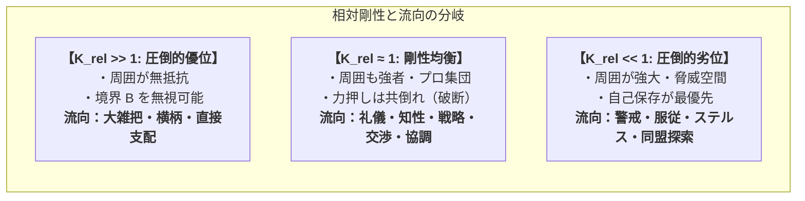

# 03_多重境界と認知勾配による性格生成

*RDL Human / 関係ネットワーク行動力学 T2 / v1.0*  
*依存: RDL_Core / 01_関係ネットワーク行動力学_総論 / SFO (空間流向診断)*

---

## ■ 0. 目的

本文書は、個体の肉体条件、周囲の他者の力関係、制度・規則、過去の記憶といった「多重の境界 $B$」が、いかにして認知空間に**ポテンシャル勾配（Potential Gradient）**を刻み込み、そこから**状況依存的な性格表現型（流向 Flow）**を生成するかを定式化する。

---

## ■ 1. 場の相対剛性（Relative Rigidity）モデル

個体 $A$ の行動は、単独の剛性（強さ）ではなく、周囲の他者・環境 $B$ との**相対剛性比 $K_{\text{rel}}$** によって支配される。

$$
K_{\text{rel}} = \frac{\text{Rigidity}(M_B^{\text{self}})}{\text{Rigidity}(M_B^{\text{environment}})}
$$



### 1.1 「礼儀と知性」の力学的起源
- 相手も自分と同等以上に強靭な場合、力任せの侵入は致命的な損害をもたらす。
- したがって、**「互いの境界 $B$ を不可侵に保つ約束（礼儀・ルール）」**と**「相手の状態を深く観察する（高 $E_{\text{sim}}$）」**が、最も自己の整合慣性を維持する最小作用経路となる。
- すなわち、**知性や礼節は、強者同士が衝突して破滅しないための高度な境界操作技術**である。

---

## ■ 2. 多重境界が作るポテンシャル勾配

認知空間 $\text{Space}_B$ の任意の座標 $x$ におけるポテンシャル $V(x)$ は、多重境界の重ね合わせとして表される。

$$
V(x) = \sum_{k} w_k \cdot \phi_k(x | B_k)
$$

ここで、
- $B_{\text{physical}}$: 肉体の疲労・限界・ダメージ壁（急峻な無限大の壁）
- $B_{\text{social}}$: 法律・倫理・社会的処罰（高い障壁）
- $B_{\text{relation}}$: 強者・敵対者（強い斥力勾配） / 味方・安心できる場（引き寄せる窪地）
- $B_{\text{tool}}$: 道具による移動・出力の容易さ（勾配のフラット化）

```text
高ポテンシャル（山・断崖） ───[負の勾配 -∇V]───→ 低ポテンシャル（谷・窪地）
危険・強者・大怪我・高コスト                      安全・親和・低コスト・成功体験
                         ↑
               エネルギーが自然に流れる（Flow）
```

---

## ■ 3. 流向（Flow）としての性格表現型

個体のエネルギー・行動ベクトル $\vec{J}$ は、勾配の傾き $-\nabla V$ と自己の駆動力（DA等）の合成として決まる。

$$
\vec{J} = -\mu \nabla V(x) + \vec{F}_{\text{drive}}
$$

### 3.1 性格変容の3大パターン

| 現象 | 勾配場の変化 | 流向（性格）の現れ方 |
| :--- | :--- | :--- |
| **肉体の鍛錬** | 以前は「険しい山（過酷・不可能）」だった領域のポテンシャルが下がり、平坦化する。 | 以前は慎重・内気だった個体が、**「大胆」「自発的」「フットワークが軽い」**性格へと変容する。 |
| **車・道具とのリンク** | 移動の物理抵抗が一瞬でゼロになり、空間全体が滑らかな斜面に変わる。 | 遮る前走車が急激な「障害・摩擦」として知覚され、**「短気」「強気」**な流向が発現する。 |
| **安心できる仲間内** | 他者境界の斥力が消え、包摂的な低ポテンシャルの盆地（窪地）が形成される。 | 普段は論理的・警戒的な個体が、**「甘え」「感情豊か」「リラックス」**した流向を見せる。 |

---

## ■ 4. 結論

> **「あの人はこういう性格だ」という固定観念は、その人が置かれている「関係ネットワークの勾配場」を無視した錯覚である。人間とは、場に引かれた多重の境界に沿って、最も自然にエネルギーを流している美しい水流（Flow）に他ならない。**
