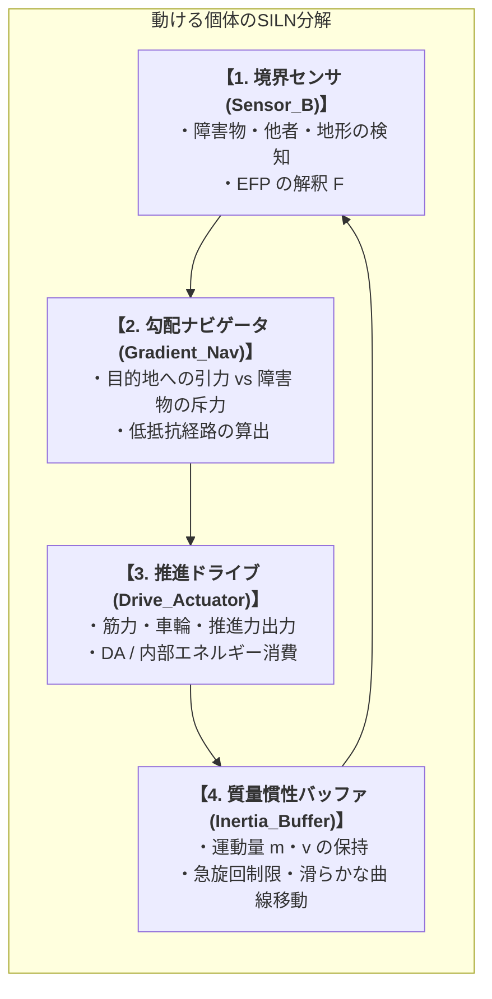

# 02_動ける個体のSILN分解と流体移動

*RDL Human / 身体・移動・流れ統一モデル T2 / DRAFT v1.0 (仮配置)*  
*依存: RDL_Core / 01_4層時間スケール構造 / 03_関係ネットワーク行動力学_T2*

---

## ■ 0. 目的と一文定義

> **空間を能動的に移動する個体（人間・動物・自律エージェント）とは、自らの自己境界 $B_{\text{self}}$ を維持しながら、環境ポテンシャル勾配と内部駆動力を統合して位置座標を連続更新する「動的SILNシステム」である。**

---

## ■ 1. 動く個体の SILN 内部構造

動く個体 $M_B^{\text{mobile}}$ は、以下の4つの主要サブ機能ノードの結合として分解される。

---

## ■ 2. 流体移動アルゴリズム（Navier-Stokes的移動最適化）

個体の空間移動は、硬直した直線歩行ではなく、**環境の障害物・他者流を水のように滑らかに迂回する「流体移動（Fluid Mobility）」**として定式化される。

$$
\frac{d\vec{v}}{dt} = -\frac{1}{\rho}\nabla V(x) + \nu \nabla^2 \vec{v} + \vec{F}_{\text{goal}}
$$

- 障害物や他者との衝突を回避しながら、エネルギー消費を最小にする滑らかなスプライン曲線軌道を描く。
