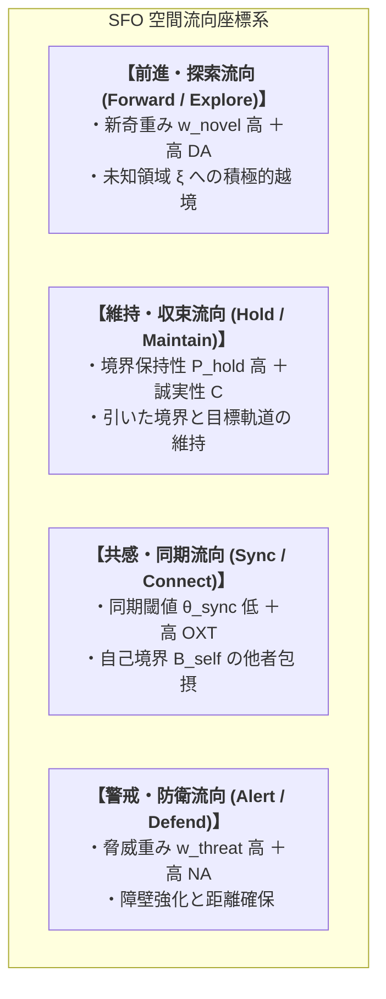

# 01_SFO空間流向診断_統合モデル

*RDL Human / 空間流向診断・性格分解 T2 / DRAFT v1.0 (仮配置)*  
*依存: RDL_Core / 03_関係ネットワーク行動力学_T2 / 人格空間生成仮説*

---

## ■ 0. 目的と一文定義

> **空間流向診断（SFO: Space Flow Orientation）は、性格を静的な固定ラベルとして分類するのではなく、個体の $M_B^{\text{person}}$ が生成した認知空間 $\text{Space}_B$ 上において、「どのような勾配が形成され、どの方向へエネルギーが流れやすいか（流向 Flow）」を可視化・診断する動的幾何モデルである。**

---

## ■ 1. SFO の4大基本流向ベクトル

---

## ■ 2. 神経力学パラメータとの結合マッピング

| SFO 流向 | 主要な神経物質変調 | RDL 力学変数 | 観測される行動傾向 |
| :--- | :--- | :--- | :--- |
| **探索流向** | ドーパミン (DA) $\uparrow$ | $w_{\text{novel}} \uparrow, P_{\text{redraw}} \uparrow$ | 開拓、挑戦、リスクテイク、多趣味、飽きっぽさ |
| **維持流向** | セロトニン (5-HT) $\uparrow$ | $P_{\text{hold}} \uparrow, R(d_{\text{goal}}) \uparrow$ | 計画性、責任感、規則遵守、忍耐、ルーティン |
| **同期流向** | オキシトシン (OXT) $\uparrow$ | $\theta_{\text{sync}} \downarrow, B_{\text{self}} \text{ 拡大}$ | 共感、ケア、チームワーク、仲間意識、おせっかい |
| **防衛流向** | ノルアドレナリン (NA) $\uparrow$ | $w_{\text{threat}} \uparrow, \theta_{\text{eff}} \downarrow$ | 危機察知、慎重、リスクヘッジ、批判的思考、緊張 |
