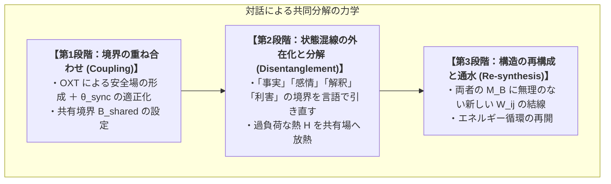

# 01_対話による共同分解プロトコル

*RDL Human / 対話・倫理・社会生態系 T3 / DRAFT v1.0 (仮配置)*  
*依存: RDL_Core / 03_関係ネットワーク行動力学_T2*

---

## ■ 0. 目的と一文定義

> **RDLにおける「対話（Dialogue）」とは、単なる情報の伝達ではなく、複数の個体（$M_B^A, M_B^B$）が共有境界 $B_{\text{shared}}$ を開き、一人では抱えきれない未回収関係 $\xi$ や状態混線を「共同で分解・放熱（Co-decomposition）」する相互代謝プロセスである。**

---

## ■ 1. 共同分解の3大ステップ

- **不毛な議論（破断モード）**: 互いの $M_B$ の硬度をぶつけ合い、境界侵犯と防衛（高NA）を繰り返して熱 $H$ だけが増大する状態。
- **健全な対話（共同分解モード）**: 対象の $\xi$ をテーブルの上に置き、2人で同じ方向を向いて境界を引き直す「共同外科手術」のような状態。
